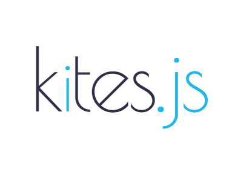

<!--  -->

<!-- # **Kites.JS** -->

<h1>kites.js</h1>

Template-based Web Application Framework

- 🚀 Extension as a feature
- ⚡️️ Autodiscover extensions
- 💎 Rich decorators system
- 🔥 Event-driven programming
- 📼 Storage mutiple providers
- ⏱ Micro frontends development

  <a href="https://github.com/kitesjs/kites" target="_blank">GitHub</a>
  <a href="#/README">Get Started</a>

