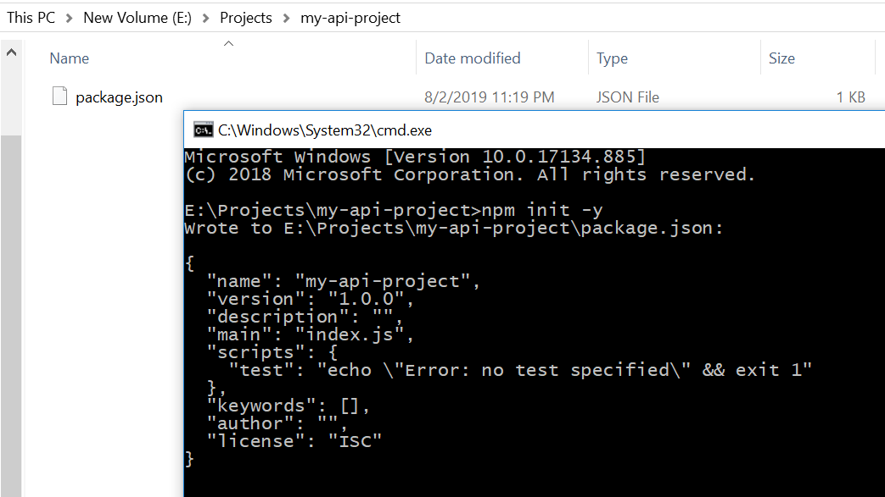
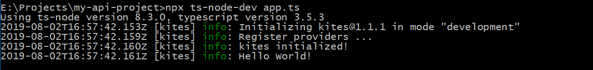
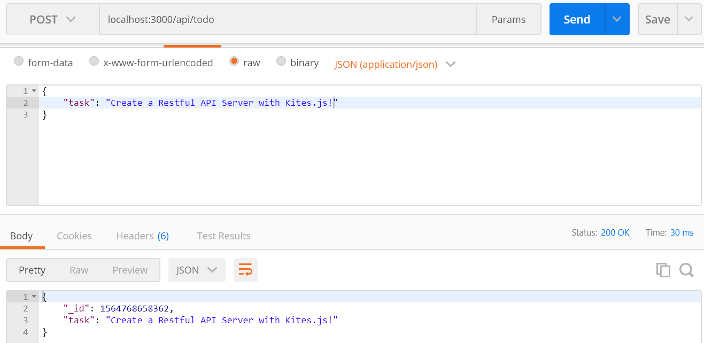
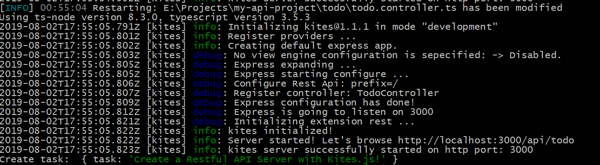

# Chào bạn,

Trong bài này mình hướng dẫn các bạn sử dụng **Kites.js** để xây dựng dự án Restful Api. Phục vụ cho các bài toán thêm, sửa, xóa dữ liệu và có thể kết hợp/tích hợp với một công nghệ phía Frontend như Angular, React, Vue, ...

Nếu bạn chưa biết kites.js là gì, hãy đọc bài viết này nhé

* https://nodejs.vn/topic/2044/kitesjs-1-gi%E1%BB%9Bi-thi%E1%BB%87u-kites-js

# Giới thiệu

Theo [codehub.vn](https://www.codehub.vn/RESTful-API-Cho-Nguoi-Bat-Dau) thì Restful Api được định nghĩa như thế này:

> RESTful API là một tiêu chuẩn dùng trong việc thết kế các thiết kế API cho các ứng dụng web để quản lý các resource. RESTful là một trong những kiểu thiết kế API được sử dụng phổ biến nhất ngày nay.

Với một trang blog, để quản lý các bài viết chúng ta có các **API URL** đi kèm với HTTP method. Ví dụ: 

* URL tạo bài viết: http://my-blog.xyz/posts. Tương ứng với HTTP method là POST
* URL đọc bài viết với ID là 123: http://my-blog.xyz/posts/123. Tương ứng với HTTP method là GET
* URL cập nhật bài viết với ID là 123: http://my-blog.xyz/posts/123. Tương ứng với HTTP method là PUT
* URL xoá bài viết với ID là 123: http://my-blog.xyz/posts/123. Tương ứng với HTTP method là DELETE

Bạn xem thêm các link trích dẫn ở mục Tham khảo cuối bài viết nhé! 

Phần sau đây là các bước cơ bản để các bạn có thể khởi tạo và phát triển dự án Restful API riêng của mình.

Cụ thể, mình sẽ hướng dẫn các bạn xây dựng khung một dự án tạo Restful API Server, một ứng dụng Todo App.

# 1. Chuẩn bị và khởi tạo dự án

Ngay trong đầu thì bạn có thể nghĩ tới các công cụ, các tài liệu thiết kế để hỗ trợ bạn khởi tạo dự án. Để đơn giản hóa, ở đây mình chỉ cần các chương trình sau:

* **NPM** - chương trình này khi bạn cài Nodejs mặc định có và có thể sử dụng trên Terminal, hoặc Command Prompt (cmd).
* **Visual Studio Code** - IDE dành riêng cho code dự án Nodejs, rất nhẹ và hiệu quả, nếu các bạn thích Notepad++ thì vẫn được
* **???** - Tạm thế đã nhé, thiếu sẽ bổ sung sau :)

1 - Tại thư mục dự án `D:\projects\my-api-project`, khởi tạo dự án từ đầu bằng lệnh sau:

```bash
npm init -y
```

Sau lệnh trên, thư mục dự án đã có một file `package.json` được sinh ra, như hình:

 

Không tệ lắm ... trên là bước đầu tiên của tất cả dự án mà ai code nodejs đều từng trải qua!

Rồi, đến đây tạm dừng một chút! Mình chợt nhớ ra là cần cài thêm một số công cụ hỗ trợ phát triển, như:

* **TypeScript** - Phiên bản nâng cao của javascript, có kiểu và cú pháp hướng đối tượng.
* **ts-node-dev** - Công cụ khởi động ứng dụng và tự động restart khi có thay đổi mã nguồn

> Các dự án thông thường mình sẽ sử dụng thêm **tslint**, trong series khởi đầu này, mình sẽ bỏ qua cho nó gọn gàng và dễ tiếp cận hơn một chút. Các bạn có kinh nghiệm rồi thì cứ setup để có được quy tắc viết mã gọn gàng, sạch sẽ nhé!

2 - Cài đặt các gói thư viện hỗ trợ phát triển

```bash
# Cài đặt gói thư viện hỗ trợ phát triển
npm install typescript ts-node-dev @types/node --save-dev

# Cài đặt thư viện phụ thuộc kites.js
npm install @kites/core @kites/common @kites/express @kites/rest reflect-metadata

# Lệnh này sẽ tạo ra file `tsconfig.json` quy định biên dịch mã
npx tsc --init
```

Sau khi cài đặt và khởi tạo `tsc`, bạn hãy thay toàn bộ nội dung sinh ra bằng nội dung sau để mình hiểu được những gì trình dịch `tsc` thực sự làm nhé:

```js
{
  "compilerOptions": {
    "module": "commonjs",
    "declaration": true,
    "noImplicitAny": false,
    "removeComments": true,
    "noLib": false,
    "allowSyntheticDefaultImports": true,
    "emitDecoratorMetadata": true,
    "experimentalDecorators": true,
    "target": "es6",
    "sourceMap": true,
    "outDir": "./dist",
    "baseUrl": "./"
  },
  "exclude": [
    "node_modules"
  ]
}
```

Mở file `package.json`, thêm vào thẻ `scripts` như sau:

```js
  "scripts": {
    "test": "echo \"Error: no test specified\" && exit 1",
    "start": "ts-node-dev --respawn --transpileOnly ./app.ts",
    "start:prod": "npm run build && node dist/app.js",
    "build": "tsc"
  },
```
Coi như đến đây đã xong phần khởi tạo dự án, chúng ta sẽ bước sang phần 2 để xem cách thức viết mã nguồn cho dự án nhé.

# 2. Viết mã nguồn

Trong bài viết [#1](https://nodejs.vn/topic/2044/kitesjs) mình đã giới thiệu tới các bạn viết một ứng dụng sử dụng Kites.js framework bằng **JavaScript** thuần. Và bây giờ, chúng ta sẽ viết lại nó bằng cú pháp **TypeScript** nhé.

Bạn hãy tạo file `app.ts` với nội dung sau đây:

```js
import { engine } from "@kites/core";

async function bootstrap() {
    const app = await engine().init();
    app.logger.info('Hello World!');
}

bootstrap();
```

Khi chạy bằng lệnh: `npx ts-node-dev app.ts` chúng ta có được kết quả tương tự như khi viết bằng mã JavaScript:

 

Sound good? Có 2 việc bạn hãy thử tiếp theo như này:

1. Thay vì dùng lệnh `npx`, bạn hãy thử gõ lệnh: `npm start`
2. Sau đó, sửa file `app.ts`, dòng số 5 thành: `app.logger.info('Hello Kites.js!');`
3. Nhấn **Ctrl+S** để lưu lại, bạn quan sát thấy gì trên Terminal?

## API Service

Ngay phần đầu, chúng ta đã đặt ra đầu bài là viết ứng dụng TODO App. Một ứng dụng Restful API thường chia api ra làm 2 thành phần: Service và Controller.

Service là phần dịch vụ, cung cấp các giao tiếp với các điểm đầu cuối, có thể đảm nhiệm thêm phần quản lý các nghiệp vụ `lặt vặt` khác nữa.

Sau đây, mình sẽ tạo ra một TodoService, có nhiệm vụ quản lý toàn bộ thông tin và trạng thái về các đầu việc (Task) cần phải làm.

1 - Tại thư mục gốc của dự án, bạn tạo ra file: `./todo/todo.service.ts` có nội dung sau:

```js
import { Injectable } from '@kites/common';

@Injectable()
export class TodoService {
  public getAll(): string {
    return 'Get all todos!!!';
  }

  public create(task: any) {
    console.log('Create task: ', task);
    return { _id: Date.now(), ...task };
  }

  public get(task: string) {
    return `Get details: ${task}`;
  }

  public begin(task: string) {
    return `Start: ${task}`;
  }

  public trash(task: string) {
    return `Move task "${task}" to trash!`;
  }
}
```
## API Controller

Sau khi có được Service, chúng ta tạo ra một Controller tuân thủ các yêu cầu đặc tả của một API Restful. Như vậy, chúng ta sẽ có và định nghĩa các method GET, POST, PUT, DELETE như đã đề cập ở trên.

2 - Bạn hãy tạo thêm một file: `./todo/todo.controller.ts` có nội dung:

```js
import { Controller, Get, Put, RequestParam, Delete, Post, RequestBody } from '@kites/rest';
import { TodoService } from './todo.service';

@Controller('/todo')
export class TodoController {

  constructor(public svTodo: TodoService) { }

  @Get('/')
  list() {
    return this.svTodo.getAll();
  }

  @Get('/:id')
  details(@RequestParam('id') task) {
    return this.svTodo.get(task);
  }

  @Post('/')
  create(@RequestBody() body) {
    return this.svTodo.create(body);
  }

  @Put('/:id')
  begin(@RequestParam('id') task) {
    return this.svTodo.begin(task);
  }

  @Delete('/:id')
  remove(@RequestParam('id') task) {
    return this.svTodo.trash(task);
  }
}
```

## Ghép nối

Đến đây thì chúng ta đã có được một API ToDo, bao gồm 1 Controller và 1 Service. Trong file `./app.ts` chúng ta sẽ cập nhật với nội dung sau đây, để chuẩn bị khởi chạy server:

```js
import { KitesFactory } from '@kites/core';
import Express from '@kites/express';
import Rest from '@kites/rest';
import { TodoService } from './todo/todo.service';

import './todo/todo.controller';

async function bootstrap() {
  const app = await KitesFactory
    .create({
      providers: [
        TodoService,
      ],
    })
    .use(Express())
    .use(Rest())
    .init();

  app.logger.info(`Server started! Let's browse http://localhost:3000/api/todo`);
}

bootstrap();
```

Phù!!! Vậy là đã xong rồi! Bài có vẻ hơi dài một chút, xong những bài sau mình có thể làm ngắn gọn hơn được và đi giải thích cụ thể từng kỹ thuật, mã nguồn đã sử dụng trong bài này.

Ví dụ như **Provider, Injectable** là gì? Hay cơ chế nạp Extension như nào, muốn tạo một Middleware trên mỗi controller, route thì làm thế nào? Cơ chế logs như nào? Còn nhiều kỹ thuật tiếp theo, hãy đón chờ nhé!

# 3. Kiểm thử

Bạn hoàn toàn có thể viết Unit Test, hay Intergration Test!

Trong phạm vi bài viết này, mình recommend bạn dùng Postman để test các api vừa được tạo ra.

Ví dụ mình test với api POST, tạo một todo task:

 

Server Logs:

 

# 4. Triển khai

* Bạn có thể triển khai dự án lên Docker, VPS, Heroku hoặc bất kỳ một Hosting nào.
* Bạn có thể copy toàn bộ mã nguồn và chạy lệnh `npm run start:prod`
* Hoặc build ra thư mục `dist`, copy thư mục này lên production server, bằng lệnh: `npm run build`

Mã nguồn cho bài viết này bạn có thể tải xuống tại đây:

* https://github.com/kitesjs/demo-rest-api-server

# Tham khảo

* https://www.codehub.vn/RESTful-API-Cho-Nguoi-Bat-Dau
* https://github.com/kitesjs/typescript-starter
