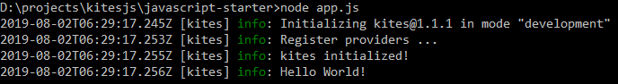

# Xin chào

Bài đầu tiên mình xin giới thiệu một framework đơn giản và nhỏ gọn, nhưng có khả năng tạo ra các ứng dụng mạnh mẽ như: `Restful API`, `CMS`, `CRM`, `Video Call`, ...

# Giới thiệu

Framework mình muốn giới thiệu tới các bạn có tên **Kites.js**, nó có nghĩa là những cánh diều, rất nhẹ và có thể bay cao!

Để đáp ứng được tiêu chí như tên gọi của nó, mình đã cố gắng thiết kế [core engine](http://npmjs.com/package/@kites/core) của nó thật đơn giản nhất, có nhiệm vụ duy nhất là có khả năng nạp tự động các Extensions được cắm vào project, tính năng **Plug and Play**.

* Một ví dụ cụ thể các bạn có thể hình dung như thế này:

```js
const kites = require('@kites/core');
 
kites.engine().init().then((app) => {
  app.logger.info('Hello World!');
});
```

* Để chạy được chương trình trên, bạn cần install các phụ thuộc cho nó như lệnh dưới đây:

```bash
npm install @kites/core @kites/common
```
* Kết quả khi chạy chương trình:

 

Trên là một ứng dụng nhỏ nhất có thể viết với Kitesjs. Như bạn thấy, nó đơn giản khởi tạo một ứng dụng kites và in ra một dòng thông điệp: `Hello World!`

Tuy nhiên, điều mà kites.js muốn hướng đến xa hơn, đó là có thể sử dụng để lập trình các ứng dụng lớn phổ biến như: **Blog**, **CMS**, **CRM**, **Restful API**, **Websockets**, **Video Call**, ...

Các bạn muốn sử dụng TypeScript để lập trình, bạn có thể clone project starter tại đây:

* https://github.com/kitesjs/typescript-starter

# Tính năng

Về tính năng cốt lõi của Framework, tập trung giải quyết các vấn đề sau:

* Extension as a feature
* Autodiscover extensions
* Micro frontends development
* Storage mutiple providers
* Rich decorators system
* Event-driven programming
* Reactive programming

Với các tính năng trên với thì Developer có thể là Backend, Frontend hoặc Full-stack developers đều có thể sử dụng một cách đơn giản, tùy vào mỗi mục tiêu của dự án. 

## Extension as a feature

Extension có nghĩa là phần mở rộng, trong kitesjs thì mỗi extension được xem như một tính năng của hệ thống. Và nó đảm nhiệm một vai trò nhất định, được phát triển độc lập mà không ảnh hướng đến hoạt động của cả hệ thống. Và đôi khi cũng có extension này là mở rộng của extension khác để đáp ứng được nghiệp vụ có yêu cầu cao hơn hoặc chi tiết hơn.

Các packages tạo nên kites cũng là các extensions độc lập, ví dụ như:

* [@kites/express](https://www.npmjs.com/package/@kites/express), Extension tích hợp ExpressJS để tạo ra web server nhanh chóng
* [@kites/rest](https://www.npmjs.com/package/@kites/rest), Extension cho phép sử dụng decorators để tạo ra các Web API
* [@kites/user](https://github.com/kitesjs/kites), Extension phép phép quản lý tài khoản người dùng và mật khẩu đăng nhập hệ thống (TODO)
* Và nhiều extension khác nữa đang được xây dựng ...

## Autodiscover extensions

Đây là tính năng tìm kiếm, phát hiện, tự động nạp các extensions nằm trong thư mục của ứng dụng, ví dụ trong thư mục `node_modules`. 

Tính năng này sẽ dựa vào một file cấu hình có tên `kites.config.js` mô tả thông tin về extension đó và các options thiết lập mặc định. Tuy nhiên các options này vẫn có thể được thiết lập lại (override) trong file cấu hình ứng dụng `kites.config.json`, `dev.config.json` hoặc `prod.config.json` trong thư mục gốc của dự án.

## Micro frontends development

Định nghĩa micro frontend có thể nói như sau:

> The idea behind Micro Frontends is to think about a website or web app as a composition of features which are owned by independent teams. Each team has a distinct area of business or mission it cares about and specialises in. A team is cross functional and develops its features end-to-end, from database to user interface. (micro-frontends.org)

Ý là về giao diện của mỗi tính năng hoàn toàn có thể phát triển một cách độc lập và tự do. Các team làm việc độc lập và không phải phụ thuộc vào nhau.

Trong các ứng dụng Single Page Application, phần render, logic của web app được nằm hoàn toàn ở phía client-side, không còn là những file HTML đơn giản nữa, thay vào đó là những phần logic phức tạp không kém so với ở backend side.

TODO: Đây là tính năng mà Framework đang hướng tới, hiện chưa ready trong phiên bản 1.x, rất mong có nhiều người nhiệt huyết tham gia đóng góp ý tưởng để feature này sớm available.

# Tham gia dự án

Toàn bộ mã nguồn của framework bạn có thể tìm thấy ở đây:

* https://github.com/kitesjs/kites

Các bạn có thể tham gia bằng một trong các cách như:

* Đóng góp ý kiến, phản biện một tính năng, hoặc có thể là tính thực tiễn của dự án
* Sử dụng framework này để làm bài tập lớn, hoặc dự án của bạn :smile:
* Tham gia sửa lỗi, viết mã phát triển framework này đáp ứng các tiêu chí về mục tiêu tính năng.

Mọi ý kiến đóng góp xin gửi về địa chỉ vunb@nodejs.vn
* Hoặc [tạo issue](https://github.com/kitesjs/kites/issues/new) trên repository: [kitesjs/kites/issues/new](https://github.com/kitesjs/kites/issues/new)
